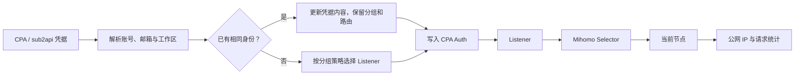

<div align="center">

# Plugin GPT Allocator

### 在 CLIProxyAPI 中集中管理 Codex 凭据、分组和 Mihomo 出口

`cpa-route-allocator` 是一个面向 **CLIProxyAPI 原生插件 ABI v1** 的凭据与出口管理插件。
它可以导入 CPA / sub2api 凭据，把凭据按组分配到预先配置的 Listener，并通过 Mihomo Selector
查看或切换实际节点。管理页面直接挂载在 CPA 现有端口下，不增加新的 HTTP 服务。

[](https://github.com/Zesuy/Plugin-Gpt-Allocator/releases)
[](https://github.com/Zesuy/Plugin-Gpt-Allocator/actions/workflows/ci.yml)
[](https://go.dev/)
[](https://github.com/router-for-me/CLIProxyAPI)
[](#支持平台)

**简体中文** · [安装](#快速开始) · [配置](#第一次使用) · [构建](#构建与发布) · [产品计划](docs/product-plan.md)

</div>

---

> [!NOTE]
> 这是一个以个人自用为主的项目，功能和兼容性主要围绕作者自己的使用环境调整，后续可能不会持续或及时维护。
> 如果它恰好适合你的环境，欢迎自行使用和修改，但请不要依赖固定的更新频率或兼容性承诺。

CLIProxyAPI 可以保存多份 Codex 凭据，但当凭据需要按账号组使用不同代理出口时，手工维护每个 Auth 文件的
`proxy_url`、Priority 和 WebSocket 设置会变得很难核对。Plugin GPT Allocator 把这些关系收敛成一套可见、
可编辑的模型：

```text
凭据 → 分组策略 → Listener → Mihomo Selector → 当前节点 → 实际公网 IP
```

> [!IMPORTANT]
> 本插件不是新的代理服务器，也不会接管 CLIProxyAPI 的模型请求。凭据保存、请求鉴权、协议转换和模型调用仍由
> CLIProxyAPI 负责；节点选择与代理链路仍由 Mihomo 负责。插件只管理两者之间的配置关系和诊断信息。

## 主要能力

| 能力 | 行为 |
| --- | --- |
| **CPA / sub2api 导入** | 支持上传或粘贴 JSON，并转换为 CPA Auth 格式；同一账号和工作区重复导入时更新内容但保留分组与路由 |
| **统一凭据命名** | 默认使用完整邮箱；同邮箱的不同工作区或鉴权上下文自动使用 `_1`、`_2` 后缀，页面别名不改动文件名 |
| **已有凭据接管** | 发现 CPA 本地 Auth 文件并选择分组接管；停止管理时保留原 Auth 文件 |
| **CPA 状态同步** | 页面开关通过 CPA Management API 启用或停用凭据；打开页面和手动同步时以 CPA 的真实 `disabled` 状态为准 |
| **CPA 运行告警** | 直接读取 CPA 根据真实模型请求维护的 `status`、`status_message` 和 `unavailable`，在凭据卡片显示工作区停用、登录失效等原因 |
| **分组策略** | 每组独立配置 Priority、WebSocket、Listener Pool 和出口不足策略；支持拖动调整分组顺序 |
| **Listener 管理** | 新建、复制、编辑和删除 Listener / Selector 映射；Selector 名称直接从 Mihomo 读取 |
| **出口诊断** | 通过每个 Listener 请求 `chatgpt.com/cdn-cgi/trace`，显示当前公网 IP 和首字节延迟 |
| **节点统计** | 按 Listener、节点和 SSE / WebSocket / 其他请求分别记录 TTFT 均值与 p95、网络断开和上游错误 |
| **手动去重** | 找出公网 IP 重复的 Listener，预览影响范围，尝试未知节点并验证新 IP；失败时回滚原节点 |
| **Codex 额度** | 按凭据手动读取额度窗口，分别展示主窗口和次窗口，不把不同窗口合并成一个数字 |

## 管理页面

管理页面参考
[Cli-Proxy-API-Management-Center](https://github.com/router-for-me/Cli-Proxy-API-Management-Center)
的凭据工作台信息层级，但使用单文件内嵌 HTML/CSS/JavaScript，随动态库一起发布。

页面分为四个主要区域：

1. **凭据管理**：按分组展示紧凑卡片，搜索、筛选、批量启停、同步 CPA 状态和查看额度。
2. **Listener 出口**：查看 Listener、Selector、当前节点、公网 IP、真实请求统计和候选节点。
3. **分组配置**：配置路由策略、拖动排序和管理 Listener Pool。
4. **导入 / 接管**：上传或粘贴凭据，预览转换结果，以及接管 CPA 已有 Auth 文件。

### 状态同步规则

- 在插件页面切换开关时，插件先调用 CPA 的 Auth status API，成功后才更新本地状态。
- 页面首次加载、点击 **同步 CPA**，或凭据/Listener 页面保持可见时每 10 秒，插件读取 CPA `host.auth.list`，按 Auth 文件名同步 `disabled`。
- 同一次读取也会取得 CPA 的实时错误状态；插件不主动发送模型测试请求，不额外消耗额度，也不会因告警自动停用凭据。
- `active`、`disabled`、`unknown` 等普通运行状态默认不显示告警；只有 CPA 明确返回错误状态、错误消息或 `unavailable` 时才显示。
- 运行告警只返回给当前页面，不写入 `state.json`；CPA 后续真实请求恢复后，刷新页面即可看到最新状态。
- 同步只改变启用状态和更新时间，不改变凭据的分组、Listener 或当前节点。
- CPA 暂时不可读时保留最后一次状态，并在页面顶部显示同步失败。
- 已管理凭据在 CPA 中找不到时只做提示，不会自动删除或改成启用。
- 外部启用导致多个凭据使用同一 Listener 时，相关凭据卡片都会显示共用警告，可在编辑窗口重新分配。

### 自动刷新规则

- 凭据状态每 10 秒刷新，请求体验统计每 5 秒刷新，Listener 节点、公网 IP 与健康诊断每 30 秒刷新。
- 请求体验和 Listener 诊断只在 **Listener 出口** 页面可见时运行；浏览器标签页进入后台后全部暂停，重新可见时立即补一次刷新。
- 打开弹窗、执行保存/切换操作、拖动分组或编辑输入框时暂停后台刷新，避免覆盖尚未提交的选择。
- 额度检查、发现本地凭据和 Mihomo 连接测试仍由用户手动触发，因为它们不是持续监控数据。

## 工作方式



### Listener 不足策略

| 策略 | 行为 |
| --- | --- |
| **返回错误** | Listener Pool 中没有空闲 Listener 时拒绝导入或重新分配 |
| **共用次数最少** | 选择当前启用凭据使用次数最少的 Listener；停用凭据不占用容量 |
| **CPA 默认路由** | 不写入 `proxy_url`，让请求继续使用 CPA 默认路由 |

停用凭据会保留原 Listener 归属，重新启用时可以继续使用原出口。如果该 Listener 已被其他启用凭据占用，
页面会询问保持共用还是按当前分组策略重新分配。

## 快速开始

### 从 GitHub Releases 安装

在 [Releases](https://github.com/Zesuy/Plugin-Gpt-Allocator/releases) 下载与 CLIProxyAPI 运行环境匹配的 ZIP。
解压后只有一个动态库，把它放到：

```text
plugins/<GOOS>/<GOARCH>/cpa-route-allocator.<ext>
```

常见示例：

```text
Linux amd64:   plugins/linux/amd64/cpa-route-allocator.so
Linux arm64:   plugins/linux/arm64/cpa-route-allocator.so
macOS arm64:   plugins/darwin/arm64/cpa-route-allocator.dylib
Windows amd64: plugins/windows/amd64/cpa-route-allocator.dll
```

Docker 部署应按 **CLIProxyAPI 容器** 的系统和架构选择资产，而不是按宿主机桌面系统选择。完成后重启 CPA。

### 启用插件

在 CLIProxyAPI 配置中启用插件宿主和本插件：

```yaml
plugins:
  enabled: true
  dir: plugins
  configs:
    cpa-route-allocator:
      enabled: true
```

随后访问：

```text
http://<CLIProxyAPI地址>:<端口>/v0/resource/plugins/cpa-route-allocator/upload
```

页面会使用 CPA 原有的 Management Key 调用管理接口，不会另外监听端口。

## 第一次使用

建议按以下顺序配置：

1. 在页面顶部输入 CPA Management Key。
2. 进入 **分组配置**，新建至少一个分组并选择 Listener 不足策略。
3. 保存 Mihomo Controller 地址和 Secret，例如 `http://192.168.5.1:9090`。
4. 新建 Listener，选择对应的 Mihomo Selector；Listener 支持 HTTP、HTTPS、SOCKS5 和 SOCKS5H。
5. 使用 **同步节点** 确认当前节点与候选节点可以读取。
6. 在 **导入 / 接管** 页面上传凭据，或接管 CPA 已有 Auth 文件。
7. 回到凭据页面点击 **同步 CPA**，确认启用状态、分组和 Listener。

### 状态文件

插件的持久状态默认保存到：

```text
plugins/data/cpa-route-allocator/state.json
```

可以通过 `CPA_ROUTE_ALLOCATOR_STATE_PATH` 覆盖。文件使用 `0600` 权限和临时文件原子替换，保存：

- 分组与顺序；
- Listener / Selector 映射；
- 凭据身份、别名、分组和路由归属；
- CPA 同步后的启用状态；
- Mihomo Controller 地址和 Secret。

Management API 返回的数据会隐藏 Mihomo Secret。完整凭据仍由 CPA Auth 存储管理，不会写入 Allocator 状态文件。

### CPA Management 地址

插件通常会跟随当前访问页面的 CPA 地址。仅在 CPA Management API 只能通过其他地址访问时设置：

```bash
CPA_ROUTE_ALLOCATOR_CPA_URL=http://127.0.0.1:8317
```

## API 导入

API 与页面上传使用相同转换器，但已有凭据的组名处理不同：

- `/upload` 只用于页面上传；如果请求试图把已有凭据换组，会拒绝。
- `/import` 允许更新已有凭据内容，但保留原分组与路由。

示例：

```bash
curl -X POST \
  'http://127.0.0.1:8317/v0/management/plugins/cpa-route-allocator/import' \
  -H 'Authorization: Bearer <Management-Key>' \
  -H 'Content-Type: application/json' \
  --data '{
    "group": "primary",
    "credential": {
      "email": "user@example.com",
      "access_token": "...",
      "refresh_token": "..."
    }
  }'
```

该接口面向自用场景，没有额外鉴权层，直接复用 CPA Management API 的鉴权。

## 诊断数据与保存时间

出口探测和真实请求统计是两组不同数据：

| 数据 | 来源 | 保存方式 |
| --- | --- | --- |
| Listener 公网 IP、TTFT | 经对应 Listener 请求 `cdn-cgi/trace` 的单次探测 | 每次诊断重新读取 |
| SSE / WebSocket / 非流式总览 | CPA `usage.handle` | 进程内从插件启动开始累计，重启清空 |
| 节点真实请求样本 | `route_slot_id + node + transport` | 每桶最多 1000 条且最长 6 小时，重启清空 |
| Selector 切换历史 | 插件记录的节点变化 | 每个 Listener 最多 100 条，重启清空 |

真实请求统计中的 TTFT 来自 CPA usage 事件；OpenAI 4xx/5xx 记为上游错误，不直接认定为节点网络故障。
EOF、连接重置、TLS、代理连接失败和超时会进入节点网络错误或超时统计。

## 手动去除重复公网 IP

去重是一个人工触发的预览和验证流程，不会定时自动切换：

1. 刷新全部 Listener 诊断，找出公网 IP 重复组。
2. 每组固定保留一个 Listener，不切换整组所有成员。
3. 共享 Selector 会被阻止，因为切换会同时影响多个 Listener。
4. 其他 Listener 优先尝试尚未被使用、IP 未知且 Mihomo 可用的节点。
5. 切换后重新探测公网 IP，并与全部 Listener 比较。
6. 如果仍重复、探测失败或网络质量不可接受，恢复原节点。

页面会先展示计划切换、保留、阻止和候选节点，确认后才执行。

## 支持平台

Release workflow 使用原生 runner 构建 CGO 动态库：

| 平台 | 架构 | 产物 |
| --- | --- | --- |
| Linux | amd64、arm64 | `.so` |
| macOS | amd64、arm64 | `.dylib` |
| Windows | amd64、arm64 | `.dll` |

Linux Release 使用 manylinux2014 环境构建，以降低 GLIBC 版本要求。动态库不能跨系统复用，必须下载与 CPA
运行平台完全匹配的资产。

## 构建与发布

本地构建需要 Go 1.22、CGO 和当前平台的 C 编译器：

```bash
make test
make race
make vet
make build
```

Linux amd64 默认产物为：

```text
dist/cpa-route-allocator.so
```

生成与 Release 相同结构的 ZIP 并验证 checksum：

```bash
VERSION=0.1.0 ./scripts/package-smoke.sh
```

普通提交和 Pull Request 会运行单元测试、竞态测试、Vet、前端 JavaScript 语法检查，并构建 Linux amd64
安装包。Release workflow 需要手动输入 SemVer；它会在六个原生 runner 上构建资产、生成统一
`checksums.txt`，然后创建或更新一个 **Draft Release**，由维护者检查后再发布。

## 当前边界

- 目前重点支持 Codex / ChatGPT 格式凭据；其他 Provider 只有在转换器能识别时才会导入。
- 节点请求归因依赖 CPA usage 中的 AuthIndex / AuthID，以及插件记录的 Selector 时间线；无法确认时不会硬算到当前节点。
- 节点统计和 Selector 历史是进程内数据，不是长期监控数据库。
- 去重不会拆分共享 Selector，也不会在后台自动轮换节点。
- 额度检查是按凭据手动触发，不提供 Keeper 式长期用量仓库和报表。
- 本项目主要用于个人部署；API 直接信任 CPA Management Key 的权限边界。

更完整的产品行为与实现边界见 [产品与工程计划](docs/product-plan.md)。

## 致谢

- [CLIProxyAPI](https://github.com/router-for-me/CLIProxyAPI)：插件宿主、Management API 与 usage 事件。
- [Cli-Proxy-API-Management-Center](https://github.com/router-for-me/Cli-Proxy-API-Management-Center)：凭据卡片和管理页面的信息架构参考。
- [GPTSession2CPAandSub2API](https://github.com/gtxx3600/GPTSession2CPAandSub2API)：CPA / sub2api 凭据转换思路参考。
- [cpa-usage-keeper](https://github.com/Willxup/cpa-usage-keeper)：TTFT 和额度读取方式参考。
- [Plugin-Deepseek-Vision](https://github.com/Zesuy/Plugin-Deepseek-Vision)：README、CI 与 Draft Release 工作流组织参考。

---

如果你只想让多个 Codex 账号按组稳定使用不同代理出口，这个插件就是为这个场景准备的。
